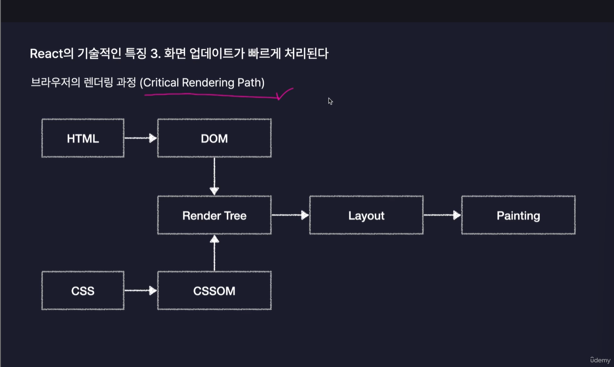
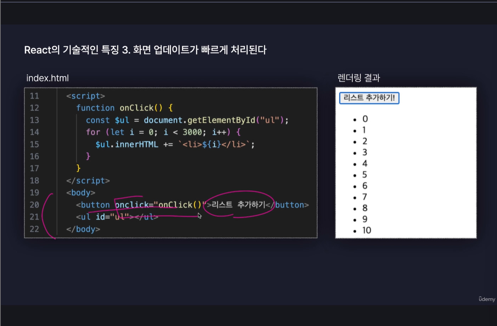
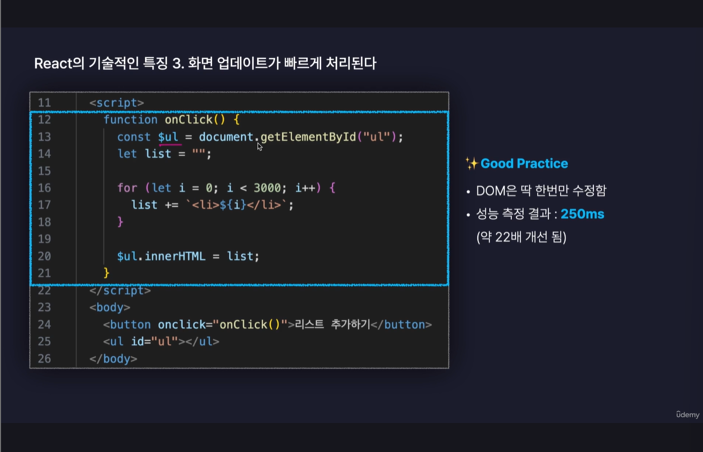

## Section03

### chapter01

React.js: Node.js 기반으로 작동

Node.js: JavaScript 실행 환경(Run Time=구동기)

Node.js는 Chrome V8 JavaScript 엔진으로 빌드된 JavaScript 런타임

JS: 웹페이지 내부에 필요한 아주 단순한 기능만 구현하기 위해 만들어짐

JS: 매우 유연하고 작성하기 쉽게 편리됨->생산성이 매우 높았음.

jS로 웹서버, 웹 바깥에서도 쓰길 원함.

Node.js를 활용해 웹 서버, 모바일 앱, 데스크톱 앱등을 만들 수 있게 됨.

### chapter02

Node.js 설치하기

터미널에 node -v 입력하면 버전 확인 가능

npm: node.js의 패키지 관리하는 도구

npm 버전 확인: npm -v

### chapter03

프로젝트: 특정 목적을 갖는 프로그램의 단위

패키지: Node.js에서 사용하는 프로그램의 단위

node로 JS 실행시킬 때에는 경로 주의하기!

->경로가 복잡해질 때 '패키지 스크립트' 이용하기

### chapter04

### chapter05

## Section04

### chapter01

->Super Bad Practice
==>한 번만 실행이 되어도 3,000번 DOM을 수정
==>성능 측정 결과: 4,500ms (성능 엄청 악화) ->4.5초동안 웹브라우저 마비

-->돔 수정 횟수를 수정하는 것이 중요.
-->but 서비스의 규모가 커질수록 점점 힘들어짐.
-->React는 이 과정을 자동으로 해줌.
-->Virtual Dom 사용하기 떄문

Virtual DOM

:DOM을 자바스크립트 객체로 흉내낸 것으로 일종의 복제판이라고 생각하면됨.

:React는 업데이트가 발생하면 실제 DOM을 수정하기 전에 이 가상의 복제판 DOM에 먼저 반영해봄. ->연습 스윙 같은 느낌.

### chapter02

React로 만들어진 웹 사이트는 사실상 어플리케이션에 가까울 정도로 많은 기능이 있기 때문에 React App이라고도 불림.

Vite:차세대 프론트엔드 개발 툴. 기본 설정이 적용된 React App 생성 가능

dev:React 앱 실행, 작동

### chapter03

section04_seulgi 파일에서 진행
