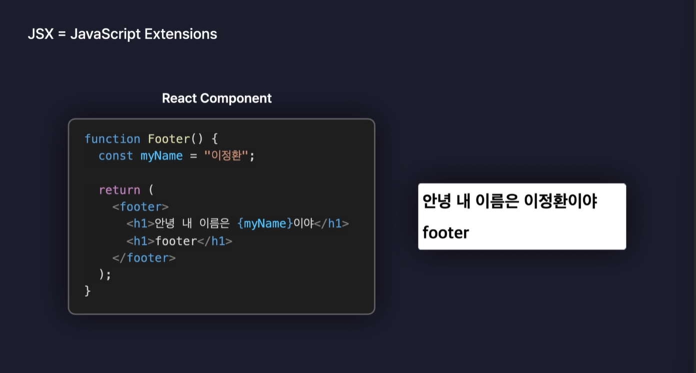

# 실습 준비하기

## 1. 새로운 React App 생성하기

npm create vite@latest

section05

React

JavaScript

## 2. 불필요한 파일 제거

APP.jsx 파일에서 import 없애기

react.svg, vite.svg 지우기 ->오류 발생: react.svg를 해석하는데 실패함. (삭제된 파일을 불러왔기 때문에 오류 발생)

useState 함수 부분 지우기 +UseState 함수 불러오는 부분도 지우기 (함수를 불러왔지만 아무데서도 사용되지 않는다.)

함수가 return되고 있는 부분 지우고 '안녕 리액트!' 적기

APP.css, index.css 모두 지우기

main.jsx에서 React.stricMode 지우기

-> 개발모드로 리액트앱을 실행하고 있을 때 우리가 작성한 코드에 잠재적인 문제가 있는지 내부적으로 검사해서 경고해주는 도구. 실습에서 필요하지 않기 때문에 삭제

## 3. 확장 -> ESLint 설치

우리가 작성한 코드를 정적으로 검사해서 혹시나 오류가 발생할만한 코드가 있으면 경고를 띄어주는 프로그램

코드를 직접 실행해보기 전에 미리 오류를 코드 상에서 확인할 수 있기 때문에 되도록이면 사용하는 것을 권장

"no-unused-vars":"off",

->코드상에 실제로 사용하지 않는 변수가 있을 때 오류로 알려주는 옵션

"react/prop-types":"off",

->react 좀 더 안전하게 사용될 수 있도록.

# React 컴포넌트

컴포넌트(Component) : 자바스크립트 함수가 태그를 반환하도록 설정할 수 있으며, 이렇게 태그들을 반환하는 함수를 컴포넌트라고 부름.

(ex)App component

함수 컴포넌트 : 함수로 만든 컴포넌트

함수 선언식 말고도 화살표 함수로 바꿔서도 만들 수 있음.

클래스를 이용해서도 컴포넌트 만들 수 있음.

->but 클래스보다 함수를 이용해서 컴포넌트를 만드는 것이 훨씬 일반적이고 대중적임. (작성해야 할 양이 많아짐)

컴포넌트 생성하는 함수의 이름은 반드시 첫글자가 대문자가 되어야함. (소문자라면 내부적으로 함수를 컴포넌트 인정하지 않음)

React는 render라는 메서드를 통해서 화면에 랜더링하고 있는 컴포넌트는 앱 컴포넌트로 설정되어있다.
->앱 컴포넌트는 잘 렌더링 되고 있지만 header 컴포넌트는 잘 렌더링되고 있지 않음.
->앱 컴포넌트 return문 안에 `<Header />` 적어서 문제해결
->App : 부모 컴포넌트(Root component)
->`<Header />` :자식 컴포넌트

모듈화를 위해서 컴포넌트별로 각각 파일을 나눠서 작성하는 것이 일반적임.

App componet (root)

아래에 Header, Main, Footer component가 있음.(대칭)

# JSX-UI 표현하기

React.js에서는 JSX 문법을 사용함.

JSX(JavaScript Extensions) : 확장된 자바스크립트 문법

JSX를 이용하면 자바스크립트와 HTML을 혼용하여 사용할 수 있기 때문에 함수가 태그를 리턴하는 수준을 넘어서 컴포넌트 내부의 변수를 하나 선언한 다음에 변수의 값을 중괄호 안에 넣어서 HTML로 렌더링하도록 설정 가능

중괄호 안에는 숫자, 삼항 연산자 등을 넣을 수 있음.

JS와 CSS를 동시에 쓰고 있기 때문에 class를 쓰지 못하고 className을 써야함.

기타 내용 정리는 파일 및 코드 내부 주석 참고

# Props로 데이터 전달하기

(ex)네이버

SearchBar component(검색창), Button component(반복적으로 렌더링)

부모 컴포넌트가 자식 컴포넌트들에게 마치 함수의 인수를 전달하듯이 원하는 값을 전달하는 것이 가능함.

->Props : 컴포넌트에 전달된 값

# 이벤트 처리하기

Event Handling : 이벤트가 발생했을 때 그것을 처리하는 것. (ex) 버튼 클릭시 경고창 노출

Event: 웹내부에서 발생하는 사용자의 행동 (ex)버튼 클릭, 스크롤 등

Handling: 다루다 처리하다

# State로 상태 관리하기

State

: 상태. 어떠한 사물이 현재 가지고 있는 모양이나 또는 형편

: 현재 가지고 있는 형태나 모양을 정의하면서 변화할 수 있는 동적인 값.

: 현재 state에 따라 각각 다른 모양이나 동작을 하게 되며 변경이 가능함.

ex.전구 켰다가 끄기/꺼져있는 전구 켜기

: State의 값에 따라 렌더링 되는 UI가 결정됨.

Re-Render/ Re-Rendering : 컴퍼넌트가 다시 rendering되는 현상.

useState

: 두개의 요소를 담은 배열 반환

->배열의 첫번째값 : 설정한 초기값

->배열의 두번째 요소: 함수 (상태변화함수)

=>구조 분해해서 할당받는 것이 일반적 ex. [state, setState]

Re-rendering

:초기에는 0이었기 때문에 0과 플러스 버튼이 렌더링되지만 +버튼을 클릭해서 1로 업데이트 시키게 되면 이 앱 컴포넌트의 역할을 하는 함수가 다시 호출되면서 스테이트의 값이 1인 상태로, 즉 업데이트가 된 상태로 다시 리턴문을 통해서 반환을 해주기 때문에 업데이트된 스테이트의 값이 화면에 즉각적으로 반영됨.

let light = "OFF"

light = light === "ON" ? "OFF" : "ON";

UseState를 쓰지 않고 위와 같이 하게 될 시 버튼이 클릭 될 때마다 변수의 값이 바뀔 수는 있지만 변수의 값이 바뀐다고 컴포넌트가 re-rendering되지는 않음.

즉 버튼을 아무리 클릭해도 아무런 변화가 일어나지 않음.

=>React component에서 변화하는 가변적인 값을 관리할 때 화며에 렌더링 시켜주고 싶다면 일반 변수가 아닌 스테이트를 이용해서 처리하도록 만들어줘야함.

# State와 Props

Bulb 컴포넌트가 계속 re-rendering되서 업데이트가 발생하고 있음.

bulb같은 자식 컴포넌트들은 부모로부터 이런 props 값이 바뀌게 되면 re-rendering이 발생하게 된다는 사실을 알 수 있음.

=> react component들은 자신이 갖는 state가 변경되지 않아도 부모로부터 받는 props의 값이 변경되면 다시 렌더링된다는 것을 알 수 있음.

re-rendering이 되는 상황

- 자신이 관리하는 state의 값이 변경되었을 때
- 자신이 제공받는 props의 값이 변경되었을 때
- 부모 component가 re-rendering이 되면 자식 component가 re-rendering됨.

# State로 사용자 입력 관리하기1

onchange 속성 이외에 value 속성까지 함께 설정하기.

select 태그 맨위 option이 기본.

select 박스는 화면에 실제로 표시되는 선택지와 실제 코드 상에서 사용할 수 있는 value값을 다르게 선택할 수 있음.

->선택지에는 좀 더 친절하고 길게 텍스트를 명시하고 내부적으로는 value를 더 간결한 값으로 사용하는 경우가 많음.

textarea: 여러 줄 입력받을 수 있음

# State로 사용자 입력 관리하기2

State로 사용자 입력 관리하기1에서 작성한 코드를 좀 더 효율적으로 작성하기.

전개연산자 / 스프레드 연산자를 사용한 이유

:name을 이전에 바꾸고 birth를 바꿨을 때 birth만 변경되고 name은 그대로 유지됨. (...input)

모든 input, select, textarea의 onchange event handler를 통합 event handler onchange로 설정해놨기 때문에 어디에 어떤 값을 입력하든 다 onchange 함수가 실행이 됨.

이 함수가 실행이 되면 setInput이라는 상태 변환 함수를 호출함.

인수로는 객체를 만들어 전달함.

스프레드 연산자로 기존에 input 값을 다 나열해준 다음에 마지막에는 property의 key를 명시하는 자리에 대괄호를 넣고 그 대괄호 안에 e.target.name이라고 넣어줌.

새로운 객체를 만들면서 property의 key 자리에 대괄호를 열고 그 안에 어떤 변수의 이름을 작성하면 e.target.name이라는 변수의 값이 property의 key로서 설정이 됨.

e.target.name이라는곳에 저장되어있는 값으로 property의 key를 설정하겠다라고 할 수 있는 것임.

# useRef -컴포넌트 변수 생성하기

useRef

:새로운 Reference 객체를 생성하는 기능.

const refObject = useRef()

useRef

:Reference객체를 생성

:컴포넌트 내부의 변수로 활용 가능

:어떤 경우에도 리렌더링을 유발하지 않음

:특정 DOM 요소에 접근 가능 -> 해당 요소 조작 가능(포커스, 변경 등)

useState

:State를 샡성

:컴포넌트 내부의 변수로 활용 가능

:값이 변경되면 컴포넌트 리렌더링

let을 사용하게 되면 계속 0으로 reset이 되서 1로 값이 고정이됨. but useref, usestate의 경우 값이 다시 reset이 되지 않음.

let count=0을 외부에 선언하면 되는 것 같지만 실제로 문제가 되지 않음. (한번만 렌더링할 때는 괜찮지만 두번 하게되면 치명적인 문제가 발생하게됨)

->두개의 register의 경우 두 컴포넌트가 하나의 변수를 공유하게됨.

# React Hooks

class 컴포넌트

:모드 기능을 이용할 수 있음

:문법이 복잡함

Function 컴포넌트

:UI 렌더링만 할 수 있음

함수 컴포넌트에서도 클래스 컴포넌트의 기능을 마치 낚아채듯이 가져와서 사용할 수 있게 해주는 React Hooks기능 개발

ReactHooks

Hook: 낚아채다

=>문법 복잡한 class component 쓸 필요 없음

:ex. useState(State 기능을 낚아채오는 Hook), useRef(Referene 기능을 낚아채오는 Hook)

:이름 앞에 동일한 접두사 use가 붙음.

:함수 내부에서만 호출될 수 있음.

:조건문, 반복문 내부에서는 호출 불가

:custom Hook도 가능.
