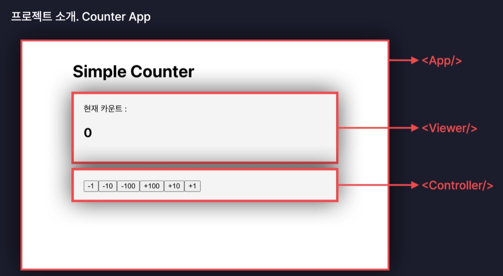
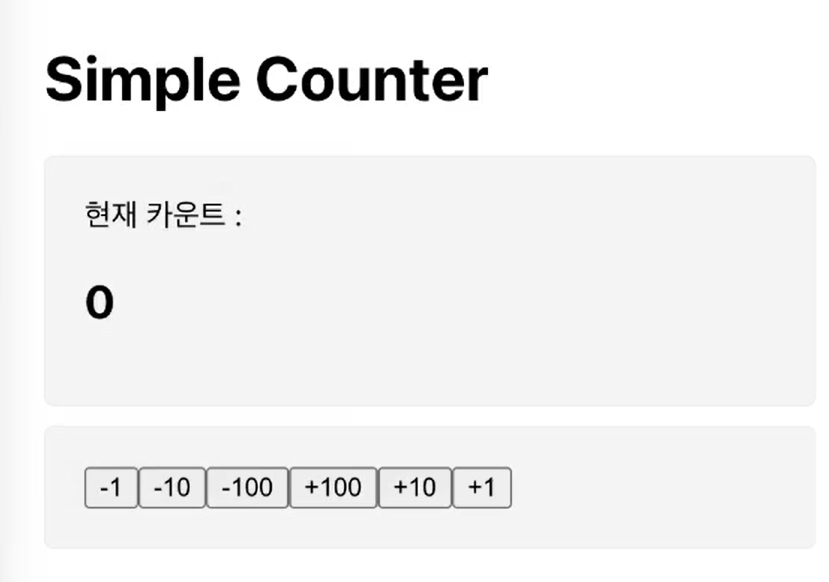
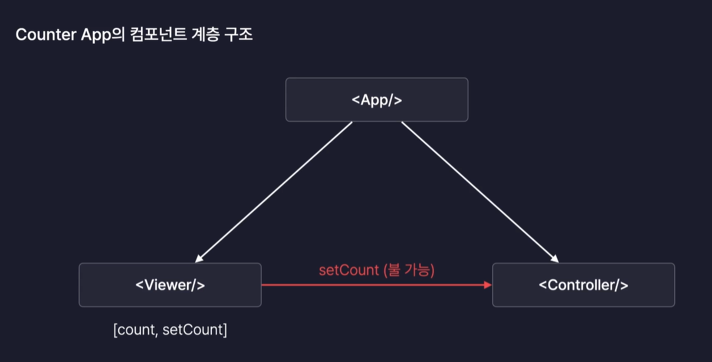
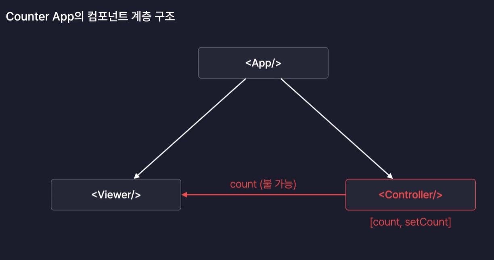
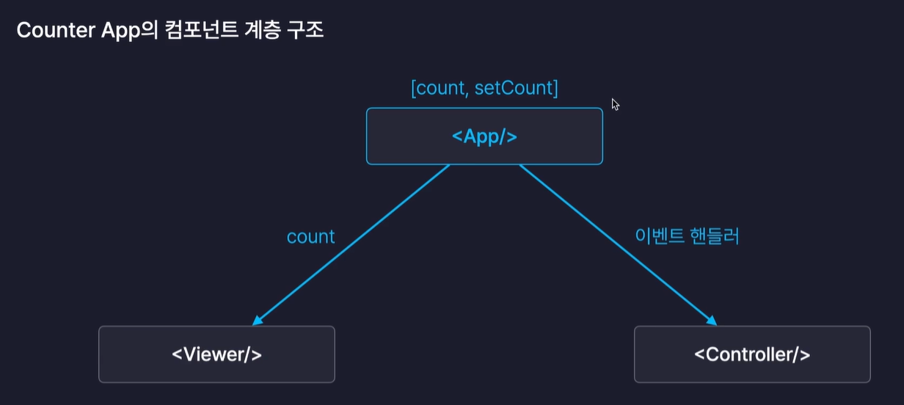
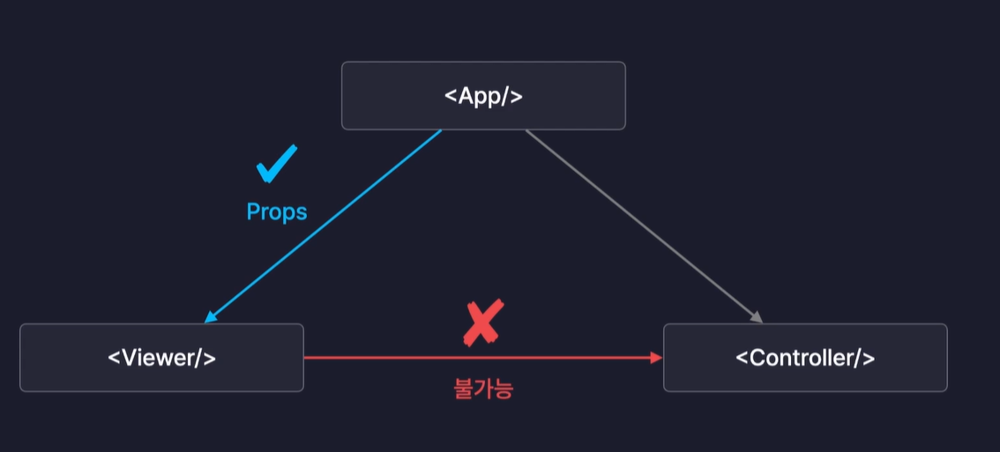
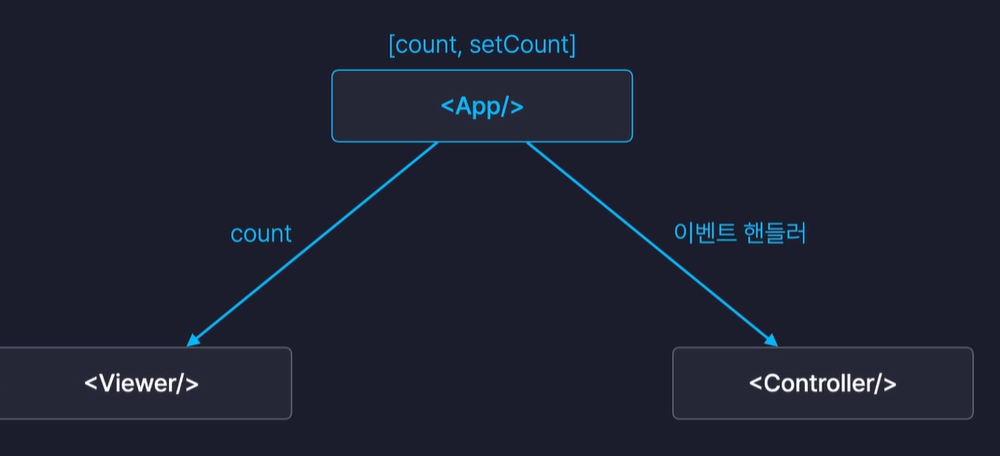
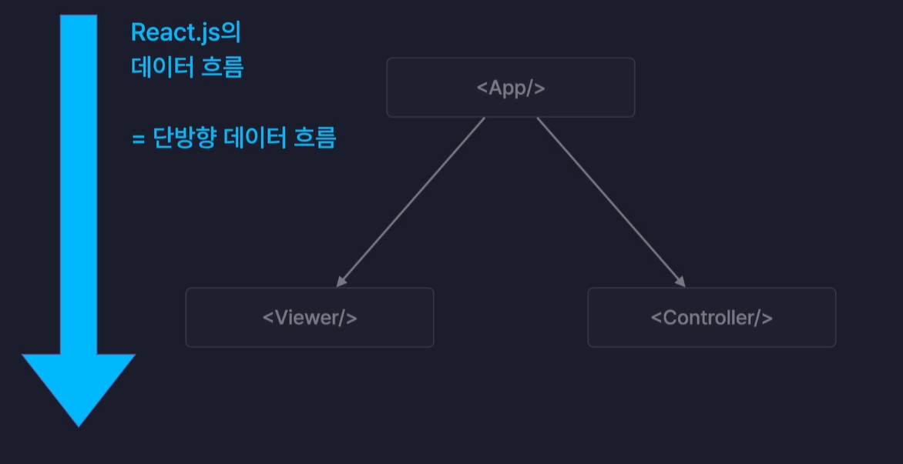
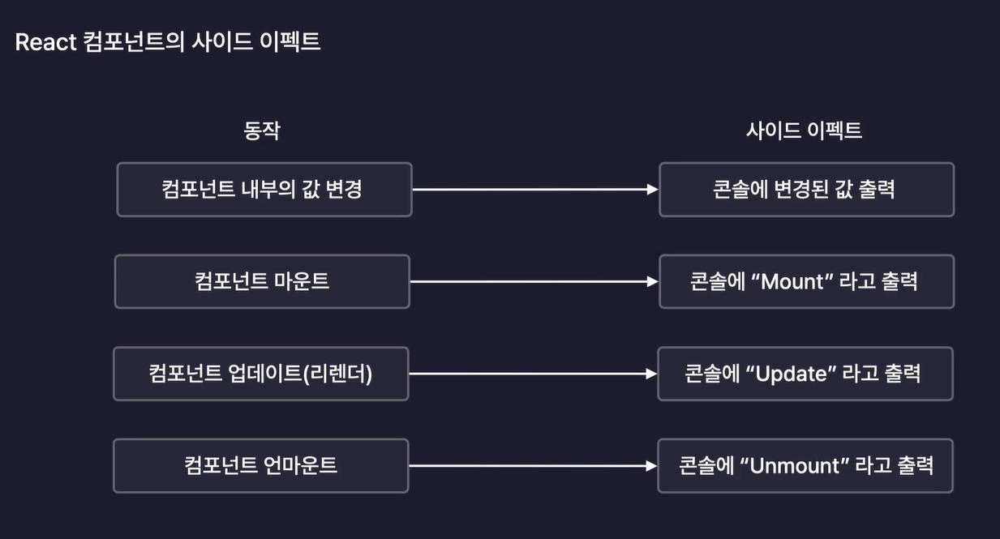
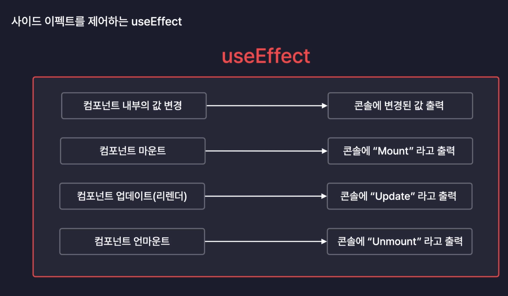

section6와 section7 한 파일에서 같이 진행함.

# Section6

## 프로젝트 소개.Counter App

버튼을 클릭하면 카운트가 증가하는 기능.

** 컴포넌트 구분 **

`<Viewer/>` : 현재 카운트 보여주는 섹션

`<Controller/>` : 카운트를 늘리거나 줄이는 버튼들이 모여 있는 섹션

`<App/>` : 앱 컴포넌트가 이 두개의 컴포넌트를 렌더링하도록 부모 컴포넌트로 만들어주기

## 프로젝트 준비

저번 주차와 마찬가지로 필요없는 이미지 및 코드 지우기

## UI 구현하기

만들어야 하는 화면

1. Viewer.jsx에서 Viewer UX 만들기
2. Controller.jsx에서 6개의 버튼 만들기
3. App component가 반환하는 UI를 완성본처럼 스타일링 설정

->section 태그로 components 묶는 이유: CSS 적용할 떄 최종 완성본처럼 component마다 백그라운드와 내부 여백 지정해주기 위함.

-->App 컴포넌트가 현재 렌더링하고 있는 요소들에 CSS에서 className으로 접근할 수 있어야함.

## 기능 구현하기

브라우저 상에 Controller component에 들어있는 버튼을 클릭하였을 때 Viewer 컴포넌트에 있는 count number를 클릭한 버튼에 따라서 증가시키거나 감소시키는 기능 추가해야함.

->count값을 state로 만들어야함. (state 값이 변경됨과 동시에 리렌더링되면서 화면에 반영이 됨)

-->state는 component 내부에서만 만들 수 있어야함.

--->App component에서 만들어야함. -> 이유: Viewer, Controller 컴포넌트는 서로 부모 자식, 관계를 가지지 않음. 그래서 어떠한 값도 서로 공유할 수 있는 방법이 없음.

react에서 component간에 데이터를 주고 받을 때는 props를 이용함. 이 props는 오직 부모에서 자식으로만 전달 될 수 있음. Viewer, Controller의 경우 부모, 자식관계가 아니고 형제 관계에 있기 때문에 이 둘이 데이터를 props로 전달한다는 것이 애초에 불가능함.

화살표 함수 안에서 onCLickButton 함수를 실행하게 만든 이유 : 'onClick={onClickButton}'으로 넣으면 인수를 원하는 것으로 전달할 방법이 없음. 함수 호출의 결과를 넣을 수도 없는 노릇.

그렇기 때문에 화살표 함수를 이벤트 핸들러로 설정하고 해당 이벤트 핸들러에서 onClickButton 함수를 호출해서 인수를 원하는 값으로 넘기도록 설정해줌.

## 최종 정리

1. react에서 화면을 구성할 때 여러개의 컴포넌트들이 서로 부모와 자식 관계를 이루며 계층 구조를 형성함.

2. 특정 컴포넌트가 다른 컴포넌트에게 데이터를 전달하려면 반드시 두 컴포넌트는 서로 부모, 자식 관계를 가지고 있어야함.
   

3. 하나의 state를 여러 컴포넌트에서 관리하게 될 경우 이 state는 반드시 이런 컴포넌트들의 공통 부모가 되는 곳에 만들어야 함.
   

State Lifting(State 끌어 올리기) : state를 계층 구조 상에서 위로 끌여올려서 그 아래에 있는 컴포넌트들이 모두 공유할 수 있도록 만드는 방법

->단방향 데이터 흐름: 데이터 흐름이 위에서 아래로만 내려감. (파악하기 매우 쉽고 직관적)

-->데이터의 원천인 state를 어떤 컴포넌트에 위치 시킬 것인지 항상 고민하고 고려하여 결정해야함.

# Section7

## LifeCycle

생애 주기: 인간이나 다른 것의 탄생~죽음까지의 단계

react 컴포넌트의 라이프 사이클

:Mount -> Update -> UnMount

- Mount

:Like.탄생

->컴포넌트가 탄생하는 순간

->화면에 처음 렌더링 되는 순간

"A 컴포넌트가 Mount 되었다." => A 컴포넌트가 화면에 처음으로 렌더링 되었다.

- Update

:Like.변화

->컴포넌트가 다시 렌더링 되는 순간

->리렌더링 될 때를 의미

"A 컴포넌트가 Update 되었다." => A 컴포넌트가 리렌더링 되었다

- UnMount

:Like.죽음

->컴포넌트가 화면에서 사라지는 순간

->렌더링에서 제외 되는 순간을 의미

"A 컴포넌트가 UnMount 되었다." => A 컴포넌트가 화면에서 사라졌다.

< 라이프 사이클제어> -> useEffect를 사용하면 손쉽게 구현 가능

Mount: 서버에서 데이터를 불러오는 작업

Update: 어떤 값이 변경되었는지 콘솔에 출력

UnMount: 컴포넌트가 사용하던 메모리 정리

## useEffect 사용하기

useEffect : react component의 사이드 이펙트를 제어하는 새로운 React Hook

사이드 이펙트: 부작용. 어떤 동작에 따른 '부수적인 효과', '파생되는 효과' 정도로 해석 가능

ex.과식을 하면 살이 찐다

->살이 찐다: 파생되는 효과(사이드 이펙트)

=>React 컴포넌트의 Side Effect : 컴포넌트의 동작에 따라 파생되는 여러 효과

useEffect를 활용하면 사이드 이펙트를 새롭게 만들거나 제어가 가능함.

## useEffect로 라이프사이클 제어하기

1. 마운트 : 탄생

2. 업데이트: 변화, 리렌더링

3. 언마운트 : 죽음

## React 개발자 도구 사용하기

React Developer Tools : 크롬에 설치할 수 있는 확장 프로그램

확장 프로그램 > 확장 프로그램 관리

<기본 설정>

1. 스위치 켜져 있는지 확인

2. 세부정보 스위치 켜져있는지 확인, 사이트 엑세스: 모든 사이트에서, 파일 URL에 대한 엑세스 허용 키기

3. 고정하기

개발자 도구 > >> > component

->계층 구조 확인 가능

->component가 받는 props와 hooks 확인 가능.

->State 바뀌는 것 손쉽게 확인 가능

톱니바퀴 > Highlight updates when components render 옵션 선택

->컴포넌트의 리렌더링이 발생하게 되었을 떄 하이라이트로 알려줌.

->불필요하게 리렌더링 되고 있는 컴포넌트는 무엇이 있는지 손쉽게 확인 가능
