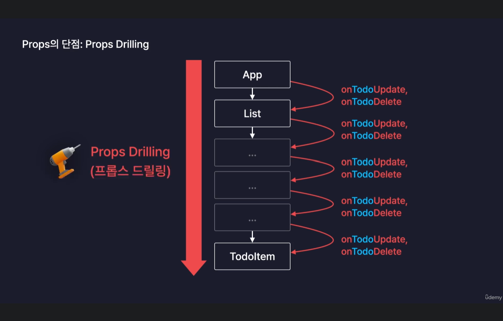
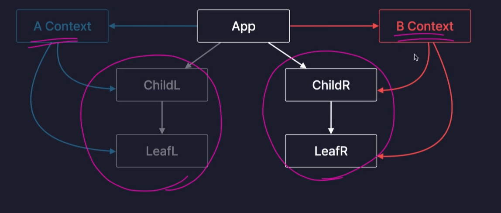
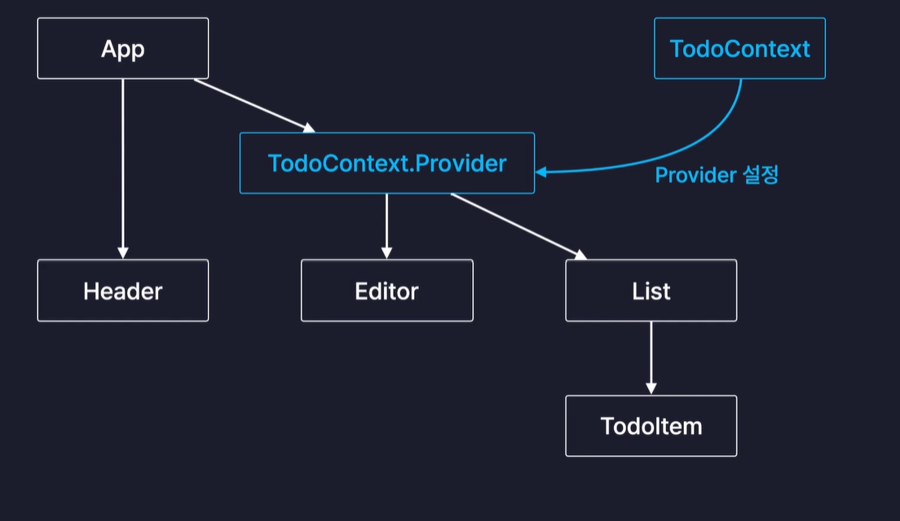
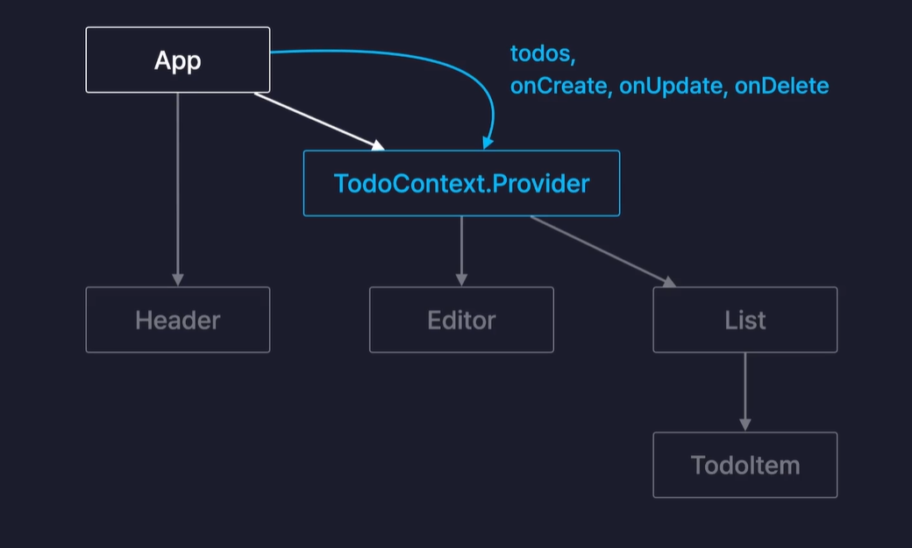
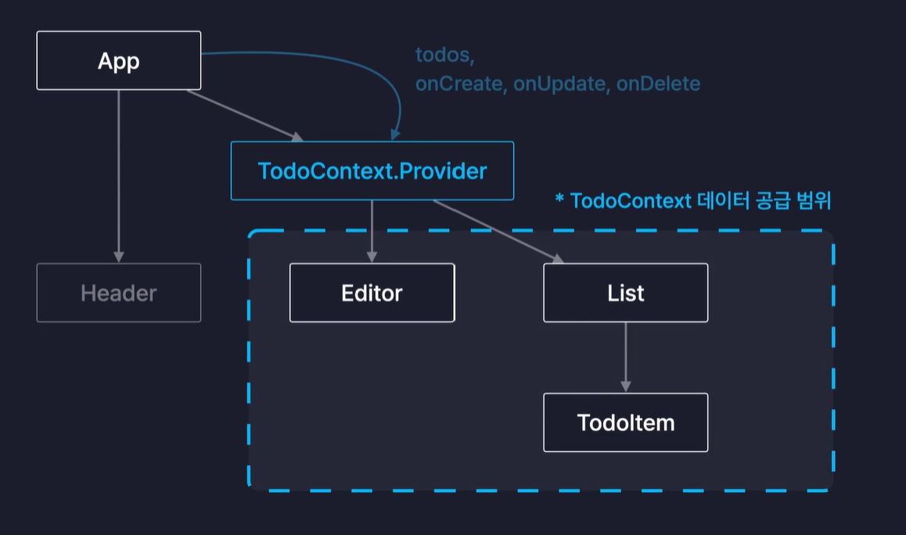
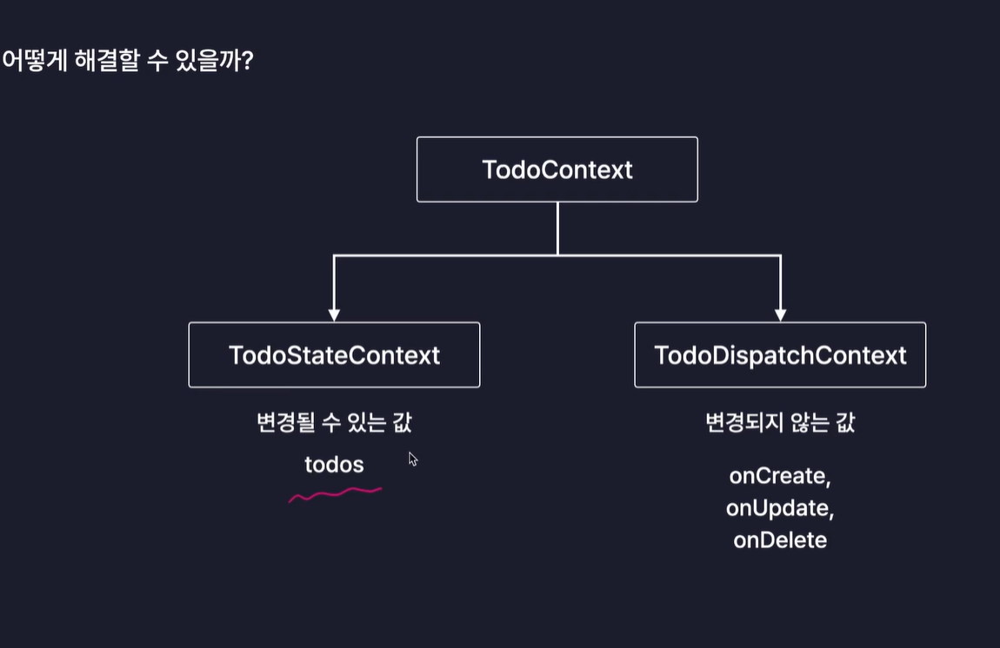
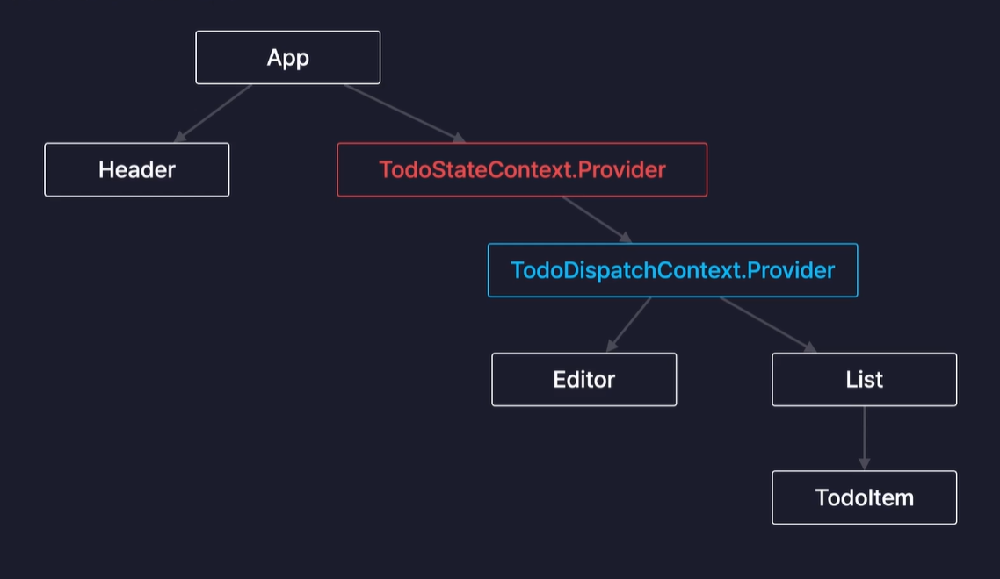
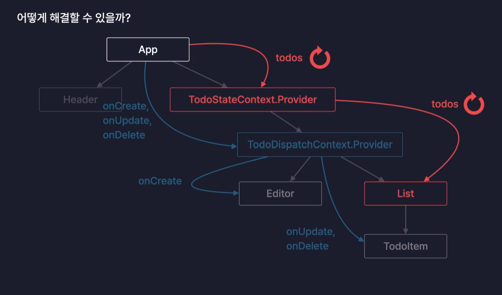

# Section09

## useReducer

: 컴포넌트 내부에 새로운 state를 생성하는 React Hook

: 모든 useState는 useReducer로 대체 가능

: useReducer를 사용하면 상태 관리 코드를 컴포넌트 외부로 분리할 수 있음(핵심)

: 컴포넌트 내부에서는 생성만 하고 컴포넌트 위부에 상태 관리 코드를 분리할 수 있음

: state를 관리하는 코드가 너무 많으면 컴포넌트 코드는 원래 UI를 렌더링하는 요소인데 주객이 전도될 수 있음. 그렇기 때문에 컴포넌트 단위에 별도의 함수를 이용하는 것이 좋음. -> useReducer

실습 예제(Exam.jsx) 흐름

'+' 버튼을 눌러서 dispatch가 호출이 되고 그럼으로써 reduce 함수가 실행이 되었을 때 매개 변수 state에는 state의 초기값인 0이 들어가게 됨.

그리고 두 번째 매개 변수인 action에는 type은 INCREASE, data는 1인 action객체가 들어오게 되면서 if (action.type === "INCREASE") 조건문이 참이 됨.

참이 되어서 현재 state값 + action.data의 값 1을 반환하고 이렇게 반환된 값이 새로운 state 값으로 반영이 되기 때문에 결과적으로 브라우저에 state가 잘 업데이트 되는 것을 볼 수 있음.

## TodoList 앱 업그레이드(useReducer)

useReducer 사용하여 TodoList 앱 업그레이드 하기

# Section10

## 최적화

**Optimization** : 웹 서비스의 서능을 개선하는 모든 행위

[일반적인 웹 서비스 최적화 방법]

- 서버의 응답속도 개선

- 이미지, 폰트, 코드 파일 등의 정적 파일 로딩 개선

- 불필요한 네트워크 요청 줄임

**[React APP 내부의 최적화 방법]**

- 컴포넌트 내부의 불필요한 연산 방지

- 컴포넌트 내부의 불필요한 함수 재생성 방지

- 컴포넌트의 불필요한 리렌더링 방지

## useMemo

**useMemo** : **"메모이제이션"** 기법을 기반으로 불필요한 연산을 최적화하는 리액트 훅

-> 메모이제이션: 기억해두기, 반복하기

최초 결과값을 메모리에 저장한 후 다시 반복적으로 연산을 수행하게 되면 그 결과값을 보냄.

자매품 : useCallback

## React.memo

**React.memo** : 컴포넌트를 인수로 받아, 최적화된 컴포넌트로 만들어 반환

```
const MemoizedComponent = memo(Component)
```

인수: 컴포넌트, 반환값: 최적화된 컴포넌트(Props를 기준으로 메모이제이션됨)

=> 불필요한 리렌더링이 방지되어서 자동으로 최적화가 이루어짐

불필요하게 리렌더링되고 있는 컴포넌트

-> Header component

함수들은 객체형태이기 때문에 주소값을 기준으로 저장됨. 내부적으로 완전히 동일한 값이 있기 때문에 생성될 때마다 주소값이 다름.

memo(TodoItem): 매번 리렌더링이 발생할 때마다 현재와 과거의 props를 판단하여 TodoItem을 리렌더링 할지 말지 결정함

-> 얕은 비교 진행 (===)

=> 객체 타입 값은 무조건 다른 값이라고 판단하게 됨.

---> 해결하는 방법

1. App component에서 함수들 자체를 메모이제이션해서 렌덜링이 되더라도 다시 생성되게 하지 않게 방지하는 방법

-> 이렇게 하기 위해서는 useCallback이라는 react hook을 사용해야함.

2. 두 아이템 컴포넌트의 메모 함수 안에 두번째 인수로 콜백함수를 추가로 전달하여 최적화 기능을 커스터마이징 하기

## useCallback

Q1. 최적화를 언제 하는 것이 좋은가. (기능 -> 최적화)

보통 react 앱을 최적화할 때는 하나의 프로젝트를 거의 완성한 상태에서 최적화를 하게 됨.

그러므로 항상 기능을 구현하는 것이 먼저가 되어야 하고, 기능이 완성이 되면 그 뒤에 최적화를 하는 것이 일반적인 방법임.

-> 최적화를 위해서 useCallback과 같은 method를 적용해놓고 나면 새로운 기능을 덧붙이거나 기능을 수정해야 될 때 최적화가 풀리게 되거나 아니면 아예 고장 나게 되어 버리는 경우가 생길 수도 있기 때문.

Q2. 어떤것들이 최적화의 대상이 되어야하는가?

모든 것들에 최적화를 적용해서는 X

꼭 최적화가 필요할 것 같은 연산들이나 함수, 컴포넌트에만 최적화를 적용하는 것이 좋음.

ex. 최적화를 위해서는 props의 값을 비교하거나 메모이제이션을 위해 메모리의 컴포넌트의 결과값을 보관해 놓는 등의 연산 기능이 필요함. 그런데 그렇게 최적화하는 컴포넌트가 고작 별것도 아닌 UI를 렌더링하는 컴포넌트였다면 그냥 다시 리렌더링 시키는 것이 빠르거나 거의 비슷할 수 있음. 그렇기 떄문에 보통은 사소한 컴포넌트들까지 다 최적화 하지는 않음. **투두 아이템 컴포넌트처럼 유저의 행동에 따라서 개수가 굉장히 많아질 수 있는 컴포넌트나 함수들을 많이 가지고 있어서 코드가 무거운 컴포넌트들에 한해서만 최적화를 수행시키는 것을 권장**

==> 결론적으로 React 앱의 최적화는 최적화가 꼭 되어야 하는 것들에만 최적화를 해주는 것 추천.

# Section11

## React Context

**React Context** : 컴포넌트간의 데이터를 전달하는 또 다른 방법

-> 기존의 Props가 가지고 있던 단점을 해결할 수 있음 (Props Drilling 해결)

Props는 **부모->자식**으로만 데이터를 전달할 수 있음.



**Props Drilling** : 사진과 같이 중간다리들을 거쳐서 전달했어야 했음.









최적화가 풀린 이유:
메모를 적용했더라도 useContext로 불러온 값이 변경이되면 이것은 props가 변경된 것과 동일하게 리렌더링을 발생시킴.

-> 해결법: todoContext를 두개의 context로 분리해서 해결하자.






