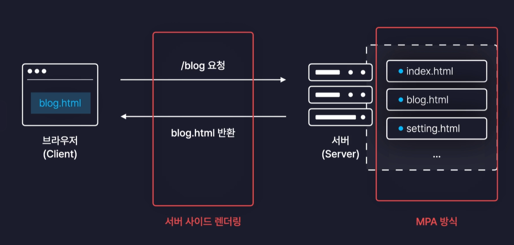
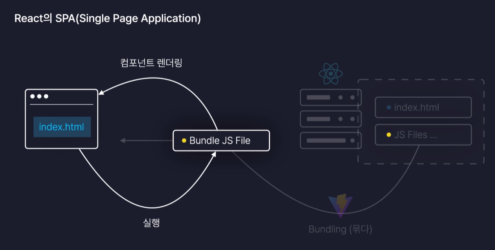
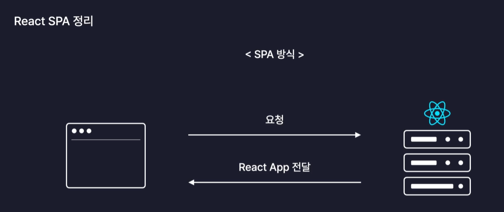
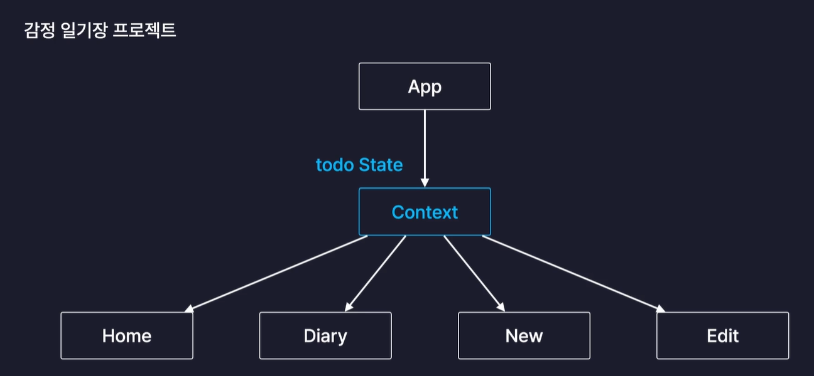
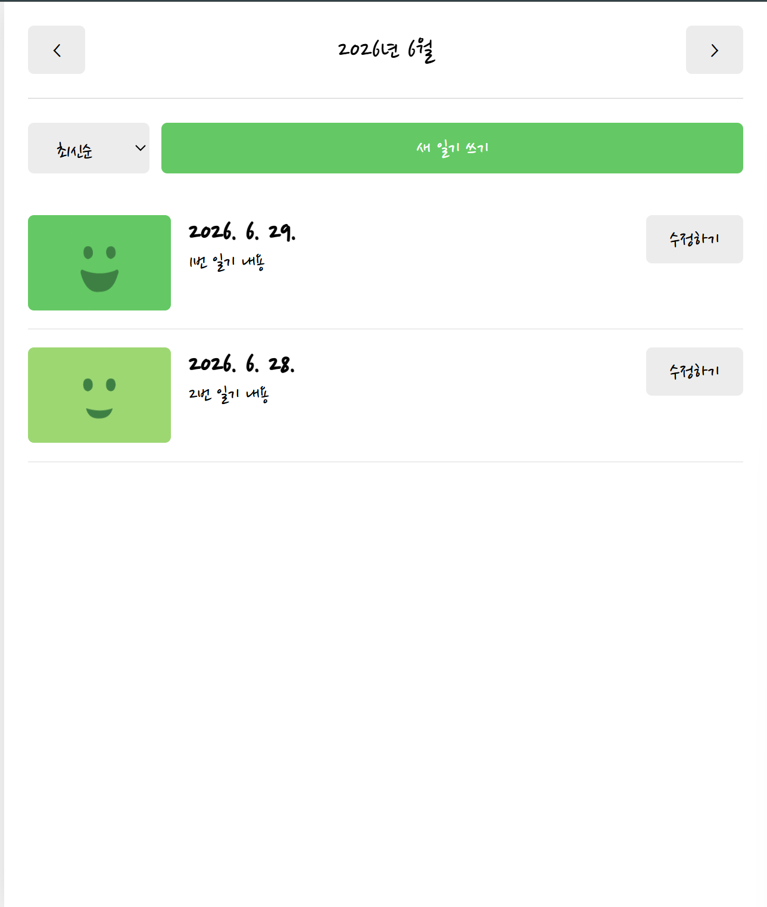
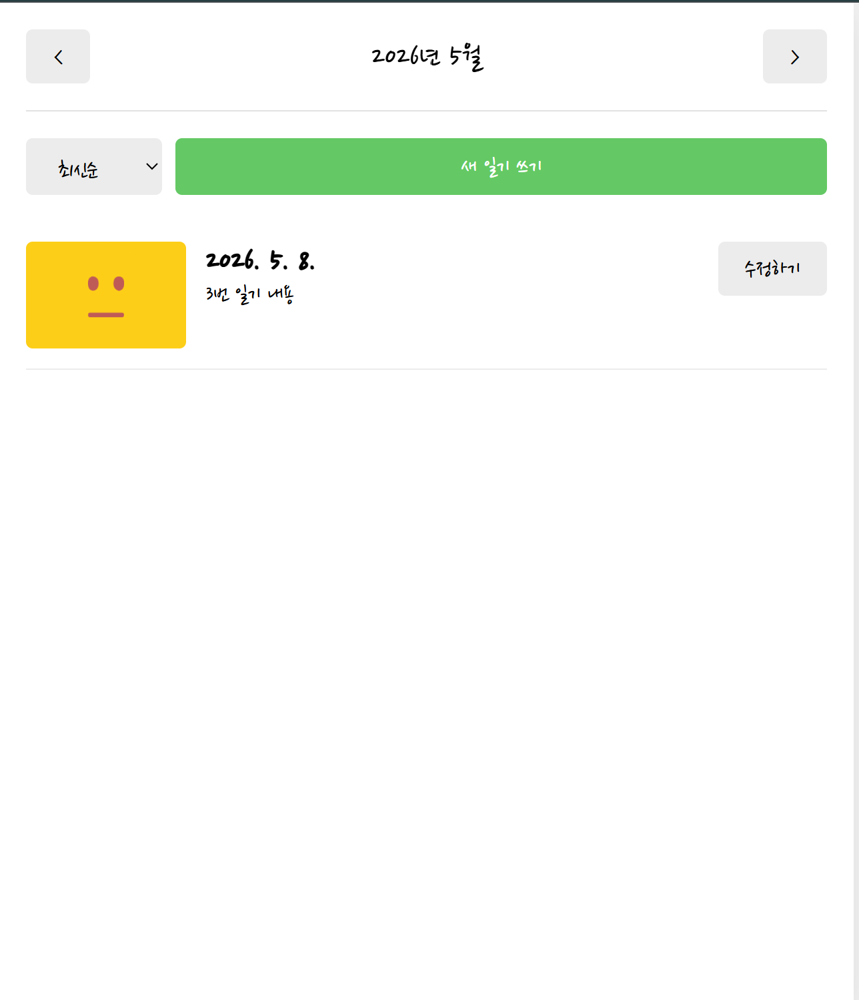

# 프로젝트 소개

## 감정 일기장 소개

- 일기를 작성하는 서비스

- 감정까지 함께 기록 가능

- 새로운 일기를 작성하는 페이지 (여러개의 페이지로 구성됨)

## 감정 일기장 프로젝트의 목표

- 외부 폰트 사용법

- 이미지 사용법(+최적화)

- 다양한 페이지를 제공하는 방법

- 공통 컴포넌트로 UI 요소 모듈화

- 복잡한 데이터 다루는 방법

- 리엑트 앱 실제로 배포하는 방법(클라우드 서비스)

# 페이지 라우팅 1.소개

## 페이지 라우팅

경로에 따라 알맞은 페이지를 렌더링 하는 과정

- ex. /new -> new페이지 렌더링

## 페이지 라우팅 원리

전통적인 방식

**Multi Page Application(MPA)**

: 애초에 서버가 여러개의 페이지를 가지고 있음. 많은 서비스가 사용하는 전통적인 방식

: 쾌적한 페이지 이동 제공이 어려움, 서버의 부하가 심해짐

: React.js는 이 방식 따르지 않음

React의 SPA

**SPA(Single Page Application)**

: React App이 채택한 방식

: 페이지 이동이 매끄럽고 효율적임, 다수의 사용자가 접근해도 크게 상관없음

:변경이 필요한 요소만 교체

React App에는 모든 페이지, 컴포넌트의 정보가 다 포함되어있음

**클라이언트 사이드 렌더링**방식 사용

# 페이지 라우팅 2.라우팅 설정하기

## React Router

npmjs.com에 등록되어 있는 라이브러리

대다수의 React App이 사용하고 있는 대표격 라이브러리

Client Sid Routing 등 제공

주의사항

1. Routes 안에는 Route 컴포넌트만 들어갈 수 있음

2. Routes 컴포넌트 밖에 있는 것은 공통으로 적용됨

# 페이지 라우팅 3.페이지 이동

버튼이나 링크를 통해 자유롭게 이동시킬 수 있도록

**Link component**: HTML의 `<a>` 태그 대신함 -> 필요한 컴포넌트만 업데이트되고 새로고침 발생하지 않음

**useNavigate**: 특정 조건에 의해서 페이지를 이동시킬 때 사용

# 페이지 라우팅 4.동적 경로

**동적 경로(Dynamic Segments)**: 동적인 데이터를 포함하고 있는 경로

**URL Parameter**

: /뒤에 아이템의 id 명시 ex.~/product/1

: 아이템의 id 등의 변경되지 않는 값을 주소로 명시하기 위해 사용됨

: useParams 이용

**Query String**

: ? 뒤에 변수명과 값 명시 ex.~/search?q=검색어

: 검색어 등의 자주 변경되는 값을 주소로 명시하기 위해 사용됨

: useSearchParams 이용

# 폰트, 이미지, 레이아웃 설정하기

- 사용할 폰트 : Nanum Pen Script (public폴더)

- 사용할 이미지 : 완전좋음~끔찍함 5개 이미지 (assets 폴더)

폰트 파일은 public, 이미지 파일은 assets에 넣은 이유 : 비트가 내부적으로 진행하는 이미지 최적화 기능 때문.

public에 이미지 넣을 경우: `/emotion1.png `이런식으로 일반적인 주소로 elements 창에 뜸. (새로고침할 떄마다 매번 새롭게 불러옴)

network창에서 확인해보면 새로고침할 때마다 size가 매번 나옴. (매번 새로 호출)

assets에 이미지 넣을 경우: URI 형태 (최적화)

network창에서 확인해보면 size는 memory cashed라고 출력됨(메모리에 이미 저장된 상태-> 다시 불러오지 않음)

주의: 만약 불러와야하는 이미지가 엄청나게 많다면 다 브라우저 메모리에 캐쉬해두면 그것또한 메모리 용량에 문제가 될 수 있음 -> public을 사용하는 것이 좋음.

=> 적은 양의 이미지: assets 폴더에 이미지 넣기

=> 많은 양의 이미지: public 폴더에 이미지 넣기

# 공통 컴포넌트 구현하기

페이지 라우팅, 글로벌 레이아웃 설정, 공통 컴포넌트 구현, 개별 페이지 및 복잡한 기능 구현 순으로 구현.

공통 컴포넌트를 먼저 구현하는 이유: 이리저리 이동하면서 정신없이 코딩하는 것을 최대한 방지할 수 있음

# 일기 관리 기능 구현하기1

감정 일기장 프로젝트: '일기'라는 형태의 데이터를 관리하는 프로그램

home: 일기 리스트 렌더링

diary: 일기 상세 조회

new: 새로운 일기 작성

edit: 기존 일기 수정

일기 데이터 저장할 state 생성하고 임시 데이터 만들어서 초기값으로 설정하기

# 일기 관리 기능 구현하기2

새로운 일기 추가, 기존 일기 수정, 기존 일기 삭제 기능 구현

# Home 페이지 구현하기 1.UI

구현할 페이지: 여러개의 일기를 리스트로 렌더링하는 "Home" 페이지

Home component

- Header component

- DiaryList component

- DiaryItem component

# Home 페이지 구현하기 2.기능

Home 페이지 기능 구현하기

# Home 페이지 구현하기 3.회고

일기 데이터를 보관하기 위해 useReducer 사용

data 초기값은 Mockdata 활용

일기 데이터를 모든 페이지에서 다 사용해야하기 때문에 App component에 배치함

Props Drilling 방지 위해 Context 사용(App->Edit->Editor (x) App->Editor(O))

leftChild, rightChild 활용

월 단위로 변경되는 날짜 데이터 저장하기 위해 pivotDate 사용

시작시간과 마지막 시간 정의하고 이를 활용하여 달마다의 일기 필터링

home component 역할 : 날짜를 월별로 이동시킬 수 있는 header component 호출, 이번달에 있는 달력들만 리스트해서 DiaryList에 넘겨주는 역할

DiaryList 역할: 실제로 List 렌더링, 일기 데이터 리스트 형태로 실제로 렌더링

menu_bar(정렬필터), List_wrapper(리스트로 렌더링하여 화면에 실제로 정렬시킴) section

## 12.12까지 만든 웹페이지

